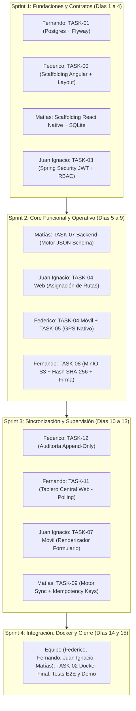

# BACKLOG INTEGRAL DE DESARROLLO - PROYECTO PLANILLERO
## Plataforma de Digitalización de Visitas de Supervisión en Campo

**Contexto del Proyecto:**
- **Backend:** Monolito Modular en Spring Boot (Java 21), organizado en dominios lógicos (Core/Config, Visitas, Formularios, Evidencias, Auditoría, Seguridad/Admin).
- **Frontend Móvil (Operador):** Aplicación móvil en React Native para Tablets Android 10'' LTE, arquitectura Offline-First.
- **Frontend Web (Supervisor/Admin):** SPA en Angular para backoffice central (gestión, monitoreo por excepciones, asignación y auditoría).
- **Persistencia:** PostgreSQL con soporte JSONB + Almacenamiento de objetos S3-compatible (MinIO) + SQLite/SQLCipher local en el móvil.
- **Repositorios:** Proyectos separados para Backend y Frontends, gestionados sobre un mismo tablero unificado de backlog.

---

### ALCANCE DEL MVP Y GESTIÓN DE DEPENDENCIAS
Para la entrega del **MVP**, se priorizan las tareas esenciales del flujo transaccional y se posponen para Fase 2 las siguientes:
- **`TASK-06` [POST-MVP]:** Identificación Biométrica Guiada (DNI/Rostro y RENAPER).
- **`TASK-10` [POST-MVP]:** Sistema de Alertas Críticas en Tiempo Real y RabbitMQ Outbox.
- **`TASK-13` [POST-MVP]:** Módulo de Asistencia Inteligente con IA (Local SLM / LLM).

#### Matriz de Impacto y Estrategia de Desacoplamiento para el MVP:
1. **Desacoplamiento de `TASK-06` (Biometría):**
   - *Impacto en Móvil (`TASK-05`, `TASK-07` y `TASK-08`):* El flujo de la tablet pasa directamente del registro geográfico (`TASK-05`) a la selección del formulario tipificado (`TASK-07`). No se exige validación biométrica para habilitar la firma ni el cierre del acta (`TASK-08`).
   - *Impacto en Backend y Base de Datos:* El modelo del Manifiesto de Visita permite listas de evidencias de identidad vacías sin rechazar la firma digital/HMAC ni la sincronización.
   - *Impacto en Backoffice (`TASK-11`):* La vista de detalle de la visita en Angular oculta el módulo de cotejo biométrico mediante un feature flag (`enableBiometrics: false`).
2. **Desacoplamiento de `TASK-10` (Alertas y RabbitMQ):**
   - *Impacto en Infraestructura (`TASK-02`):* Se elimina o desactiva el servicio RabbitMQ en `docker-compose.yml`, reduciendo consumo de recursos en local y simplificando el despliegue.
   - *Impacto en Backoffice (`TASK-11`):* El tablero de supervisión opera mediante consultas REST periódicas (HTTP Polling configurable a 30s/60s y botón manual "Actualizar") en lugar de suscripción a WebSockets/STOMP.
   - *Impacto en Backend:* Las visitas se crean y cierran directamente mediante transacciones ACID en PostgreSQL sin requerir la tabla intermedia `outbox_events`.
3. **Desacoplamiento de `TASK-13` (Asistente IA):**
   - *Impacto en Formularios (`TASK-07`):* Las observaciones de excepción se registran como texto plano tipificado tradicional con límite de caracteres y validación estándar, sin asistencia semántica de LLM.
   - *Impacto en Backoffice (`TASK-11`):* El supervisor visualiza las respuestas en formato formulario/tabular estándar y las reglas de negocio críticas se evalúan mediante lógica estática tradicional.
   - *Impacto en Docker (`TASK-02`):* No se requiere desplegar Ollama ni descargar modelos pesados.

---

### EQUIPO DE DESARROLLO Y MATRIZ DE ROTACIÓN (JIRA)

Consultando los permisos del proyecto en Jira (**PLAN - Planillero**), los 4 desarrolladores autorizados son:
1. **Federico Morón**
2. **Fernando Chamorro Goncalves**
3. **Juan Ignacio Urrutia**
4. **Matías Lameiro**

Para asegurar que **todos los integrantes participen en cada aspecto técnico del proyecto** (Backend Spring Boot, Frontend Web Angular, Frontend Mobile React Native, Persistencia y Seguridad/DevOps) y acumulen commits equilibrados en el repositorio según la rúbrica del curso, se establece una **planificación por rotación cruzada equitativa**:

#### Matriz de Asignación Proporcional por Desarrollador y Sprint (Tickets Jira):

| Sprint / Fechas | Federico Morón | Fernando Chamorro | Juan Ignacio Urrutia | Matías Lameiro |
| :--- | :--- | :--- | :--- | :--- |
| **Sprint 1** (id: 35) 17/09 al 22/09 | **[PLAN-4](https://surely-sa.atlassian.net/browse/PLAN-4)**: Scaffolding Angular, Layout y UI Kit | **[PLAN-5](https://surely-sa.atlassian.net/browse/PLAN-5)**: TASK-01: PostgreSQL 16 y Flyway | **[PLAN-6](https://surely-sa.atlassian.net/browse/PLAN-6)**: TASK-03: Spring Security JWT y RBAC | **[PLAN-3](https://surely-sa.atlassian.net/browse/PLAN-3)**: Scaffolding React Native / **[PLAN-2](https://surely-sa.atlassian.net/browse/PLAN-2)**: Spring Boot |
| **Sprint 2** (id: 68) 23/09 al 28/09 | **[PLAN-9](https://surely-sa.atlassian.net/browse/PLAN-9)**: TASK-04/05: Agenda Móvil y GPS | **[PLAN-10](https://surely-sa.atlassian.net/browse/PLAN-10)**: TASK-08: Evidencias, Firma y SHA-256 | **[PLAN-8](https://surely-sa.atlassian.net/browse/PLAN-8)**: TASK-04 (Web): Asignación Rutas | **[PLAN-7](https://surely-sa.atlassian.net/browse/PLAN-7)**: TASK-07: Motor JSON Schema Backend |
| **Sprint 3** (id: 69) 29/09 al 04/10 | **[PLAN-11](https://surely-sa.atlassian.net/browse/PLAN-11)**: TASK-12: Auditoría Append-Only | **[PLAN-12](https://surely-sa.atlassian.net/browse/PLAN-12)**: TASK-11: Tablero Central Web | **[PLAN-13](https://surely-sa.atlassian.net/browse/PLAN-13)**: TASK-07: Formulario Móvil Dinámico | **[PLAN-14](https://surely-sa.atlassian.net/browse/PLAN-14)**: TASK-09: Motor Sync Offline con Idempotencia |
| **Sprint 4** (id: 70) 05/10 al 09/10 | **[PLAN-15](https://surely-sa.atlassian.net/browse/PLAN-15)**: TASK-02: Docker Compose Final | **[PLAN-16](https://surely-sa.atlassian.net/browse/PLAN-16)**: Auditoría UX Móvil Tablet | **[PLAN-17](https://surely-sa.atlassian.net/browse/PLAN-17)**: Ciberseguridad OWASP y Demo | **[PLAN-18](https://surely-sa.atlassian.net/browse/PLAN-18)**: Auditoría UX/UI Web Angular |

*Backlog General (Post-MVP):*
- **[PLAN-19](https://surely-sa.atlassian.net/browse/PLAN-19)**: TASK-06 [Post-MVP]: Identificación Biométrica Guiada (DNI/Rostro) y RENAPER
- **[PLAN-20](https://surely-sa.atlassian.net/browse/PLAN-20)**: TASK-10 [Post-MVP]: Sistema de Alertas Críticas en Tiempo Real y RabbitMQ Outbox
- **[PLAN-21](https://surely-sa.atlassian.net/browse/PLAN-21)**: TASK-13 [Post-MVP]: Módulo de Asistencia Inteligente con IA (Local SLM / LLM)

---

## LISTA DETALLADA DE TAREAS DEL BACKLOG

---

### TAREA 00: Estructura Base, Arquitectura y Scaffolding del Backoffice Web (Planillero Central)
- **Código:** `TASK-00`
- **Requerimiento que resuelve:** Requisito Estructural / Scaffolding Previo: Establecer el esqueleto fundacional del Backoffice Web en Angular y su contrato base de comunicación con el Backend Spring Boot antes del desarrollo de las funcionalidades de negocio.
- **Componentes Fullstack:**
  - **Backend:** 
    - Configuración base del proyecto Spring Boot modular (`core`, `config`, `common`).
    - Controlador base y estándar unificado de respuesta `ApiResponse<T>` con metadatos (`timestamp`, `status`, `traceId`).
    - Manejador global de excepciones con `@RestControllerAdvice` bajo especificación Problem Details (RFC 7807).
    - Configuración estricta de CORS (`CorsConfigurationSource`) habilitando el origen del backoffice Angular (`http://localhost:4200` en dev, dominio oficial en prod).
    - Configuración de documentación de APIs con OpenAPI 3 / Swagger (`springdoc-openapi-starter-webmvc-ui`).
  - **Frontend Web (Angular):** 
    - Inicialización de proyecto Angular (v17+ Standalone Components) con estructura por capas: `core` (servicios singleton, guards, interceptores), `shared` (componentes UI reusables, pipes), `layout` (estructura base) y `features` (módulos de negocio).
    - Implementación del **Layout Principal de Backoffice**:
      - *Header/Topbar Institucional:* Logo de Planillero Central, selector de entorno, reloj del sistema y menú de usuario.
      - *Sidebar Lateral:* Menú de navegación accesible y colapsable (Dashboard, Hojas de Ruta, Visitas, Auditoría, Configuración).
      - *Breadcrumbs Dinámicos:* Miga de pan para ubicación del usuario.
      - *Contenedor Central:* Área responsiva con `<router-outlet>`.
      - *Footer:* Versión de build, estado de conexión institucional y copyright.
    - Configuración del Design System (TailwindCSS / Angular Material) basado en la guía de estilos institucional (Navy `#1A365D`, Blanco/Gris `#F8FAFC`, Acentos semánticos).
    - Servicio HTTP genérico con interceptor de errores globales y barra de progreso/spinner de carga unificado (`LoadingService`).
  - **Base de Datos / Persistencia:** 
    - Creación del esquema `core` y tabla de parámetros maestros del sistema `configuracion_sistema` (`clave`, `valor`, `descripcion`, `updated_at`).
    - Migración Flyway inicial `V1_0__init_system_config.sql`.
  - **Testing:** 
    - Backend: Tests unitarios del `@RestControllerAdvice` y validación de cabeceras CORS con MockMvc.
    - Frontend: Pruebas unitarias de renderizado de componentes de layout (`SidebarComponent`, `HeaderComponent`) y pruebas de navegación con `RouterTestingModule`.
- **Evaluación UX/UI (Planillero Central):**
  - *Heurística 4 (Consistencia y estándares):* Establecimiento del Design System institucional unificado, tipografía legible y controles estándar para toda la aplicación web de escritorio.
  - *Heurística 8 (Diseño estético y minimalista):* Estructura limpia y espaciosa orientada a puestos de supervisión de oficina (1080p+), evitando saturación visual y priorizando el área de trabajo.
- **Evaluación de Ciberseguridad:**
  - *OWASP A05 (Security Misconfiguration):* CORS configurado con orígenes explícitos (prohibido `Access-Control-Allow-Origin: *`).
  - *Prevención de Clickjacking:* Headers HTTP `X-Frame-Options: SAMEORIGIN` y directiva CSP `frame-ancestors 'self'`.
  - *Gestión Segura en Frontend:* Separación de entornos (`environment.ts`) sin incluir secretos ni claves privadas en el bundle compilado.

---

### TAREA 01: Infraestructura de Persistencia y Conexión Backend
- **Código:** `TASK-01`
- **Requerimiento que resuelve:** Creación de la base de datos relacional institucional, definición del esquema base, migraciones automatizadas y conexión resiliente con el Backend.
- **Componentes Fullstack:**
  - **Backend:** Configuración de Spring Data JPA con pool HikariCP, datasource primario, perfiles de entorno (`dev`, `test`, `prod`), configuración de transaccionalidad `@Transactional` y dialecto PostgreSQL con extensiones espaciales/JSONB.
  - **Frontend:** Indicador visual en el backoffice de salud de la base de datos conectando con `/actuator/health`.
  - **Base de Datos:** Instancia de PostgreSQL 16+. Creación de base de datos `planillero_db`, esquemas lógicos (`core`, `visitas`, `formularios`, `auditoria`). Migraciones con **Flyway** (`V1_1__init_schema.sql`).
  - **Testing:** Tests de integración con **Testcontainers** levantando PostgreSQL real en contenedor; verificación de rollback transaccional y validación de esquemas.
- **Evaluación UX/UI (Planillero Central):**
  - *Heurística 1 (Visibilidad del estado del sistema):* Indicador en el panel administrativo del estado de latencia y disponibilidad de la conexión a la base de datos.
- **Evaluación de Ciberseguridad:**
  - *OWASP A05 (Security Misconfiguration):* Contraseñas no expuestas en el código fuente; uso de variables de entorno (`SPRING_DATASOURCE_PASSWORD`); desactivación de endpoints sensibles de Actuator.
  - *Principio de menor privilegio:* Usuario de la base de datos con permisos estrictos de DDL/DML, sin privilegios de superusuario (`postgres`).
  - *Cifrado en tránsito:* Conexión SSL/TLS obligatoria (`sslmode=require`) entre backend y PostgreSQL.

---

### TAREA 02: Dockerización Integral del Ecosistema y Orquestación de Entornos
- **Código:** `TASK-02`
- **Requerimiento que resuelve:** Dockerizar todo el proyecto para el MVP (Backend Spring Boot, Frontend Web Angular, servicios PostgreSQL y MinIO/Object Storage) en un entorno reproducible y aislado.
- **Componentes Fullstack:**
  - **Backend:** `Dockerfile` multi-stage build para Spring Boot (OpenJDL 21 / Eclipse Temurin), optimizando tamaño de capas y cache de dependencias Maven/Gradle.
  - **Frontend:** `Dockerfile` multi-stage build para Angular servido a través de NGINX Alpine optimizado con compresión Gzip y headers de seguridad. Script de empaquetado para React Native Android (APK en contenedor).
  - **Base de Datos y Servicios:** `docker-compose.yml` integrando: PostgreSQL con volumen persistente, MinIO (Object Storage S3 para evidencias y actas) y red interna aislada (`planillero-net`). *(Nota MVP: RabbitMQ y Ollama quedan excluidos del compose para optimizar recursos)*.
  - **Testing:** Script automatizado de healthcheck que levanta el compose completo en CI/CD y valida que todos los contenedores alcancen estado `healthy` y respondan a pruebas HTTP `curl`.
- **Evaluación UX/UI:**
  - *Heurística 5 (Prevención de errores) y 9 (Ayuda a reconocer errores):* Configuración en NGINX de páginas de error HTTP 404, 502 y 503 personalizadas y amigables.
- **Evaluación de Ciberseguridad:**
  - *OWASP A06 (Vulnerable and Outdated Components):* Contenedores ejecutados como usuarios sin privilegios (`non-root user`); imágenes base mínimas (Alpine/Distroless).
  - *Gestión de Secretos:* Archivo `.env.example` en repositorio; archivo `.env` agregado estrictamente a `.gitignore`.
  - *Headers de Seguridad HTTP:* NGINX configurado con CSP, HSTS, X-Frame-Options: DENY y X-Content-Type-Options: nosniff.

---

### TAREA 03: Autenticación Centralizada (OIDC/JWT), Gestión de Sesiones y Control RBAC
- **Código:** `TASK-03`
- **Requerimiento que resuelve:** MVP-09 / Requisito de Seguridad: Autenticación de usuarios, renovación segura de tokens, soporte 2FA para roles jerárquicos y control de acceso basado en roles (Operador, Supervisor, Administrador).
- **Componentes Fullstack:**
  - **Backend:** Spring Security 6 con OAuth2 Resource Server / JWT. Emisión y validación de Access Token (15 min) y Refresh Token (rotativo con revocación en base de datos). Filtro de autorización RBAC (`@PreAuthorize("hasRole('SUPERVISOR')")`). Endpoint de autenticación 2FA (TOTP RFC 6238).
  - **Frontend Móvil (React Native):** Pantalla de Login de alto contraste. Almacenamiento seguro de tokens mediante `react-native-keychain` / Keystore hardware-backed. Bloqueo rápido por PIN local biométrico si la sesión sigue activa.
  - **Frontend Web (Angular):** Pantalla de Login administrativo con soporte para solicitud de código 2FA. `HttpInterceptor` para inyección de cabecera `Authorization: Bearer` y refresco automático de token. Guardas de navegación (`AuthGuard`, `RoleGuard`).
  - **Base de Datos:** Tablas `usuarios`, `roles`, `usuario_roles`, `refresh_tokens` (con hashing del token y estado de revocación), `intentos_fallidos_login`.
  - **Testing:** Tests unitarios de hashing de claves con Argon2id/BCrypt; tests de expiración y revocación de JWT; test de integración validando denegación 403 Forbidden ante roles insuficientes.
- **Evaluación UX/UI:**
  - *Heurística 8 (Diseño estético y minimalista):* Login sobrio, interfaz clara con teclado numérico optimizado para ingreso de PIN o código 2FA.
  - *Heurística 9 (Ayuda a reconocer errores):* Mensajes de error claros ("Credenciales incorrectas") sin revelar si falló el usuario o la contraseña para evitar enumeración.
- **Evaluación de Ciberseguridad:**
  - *OWASP A07 (Identification and Authentication Failures):* Bloqueo progresivo ante intentos fallidos de autenticación (fuerza bruta). Almacenamiento de contraseñas con factor de coste elevado (BCrypt factor 12 o Argon2id).
  - *Tokens seguros:* Tokens JWT firmados con RS256 (par de claves asimétricas) o HS512 con clave secreta gestionada por variable de entorno.

---

### TAREA 04: Gestión y Planificación de Hoja de Ruta y Consulta de Agenda Offline
- **Código:** `TASK-04`
- **Requerimiento que resuelve:** MVP-01 / CU-01: Planificación de visitas por el supervisor y visualización de la agenda priorizada por el operador, permitiendo consulta completa sin conectividad.
- **Componentes Fullstack:**
  - **Backend:** Endpoints REST `GET /api/v1/operadores/{id}/hoja-de-ruta` y `POST /api/v1/visitas/asignar`. Lógica de ordenamiento por urgencia, fecha de vencimiento y zona geográfica.
  - **Frontend Móvil (React Native):** Pantalla principal "Hoja de Ruta" (Figura A1 del informe). Tarjetas de visitas asignadas con indicadores visuales claros (estado, dirección, vencimiento, SLA). Cacheo en SQLite/WatermelonDB local para consulta 100% offline.
  - **Frontend Web (Angular):** Módulo de planificación para el supervisor integrado en el layout de backoffice. Tabla de asignación de visitas a operadores, selector de fecha, filtros por estado y mapa básico de distribución.
  - **Base de Datos:** Tablas `hojas_de_ruta`, `visitas`, con índices en `(operador_id, fecha_programada, estado)`. Estructura local en SQLite del móvil replicando la visita precargada.
  - **Testing:** Tests unitarios de ordenamiento de agenda por prioridad; pruebas frontend en React Native simulando modo avión y validando renderizado íntegro desde SQLite.
- **Evaluación UX/UI:**
  - *Heurística 1 (Visibilidad del estado):* Barra superior fija indicando "Modo Offline / Modo Conectado", batería del dispositivo, estado del GPS y cantidad de visitas pendientes.
  - *Heurística 7 (Flexibilidad y eficiencia de uso):* Lista en columna única con botones táctiles grandes (> 48x48 dp) accesibles con guantes de trabajo o una sola mano bajo luz solar directa.
- **Evaluación de Ciberseguridad:**
  - *Protección de Datos Personales (Privacidad / Habeas Data):* Datos del supervisado almacenados en SQLite cifrada con **SQLCipher** utilizando clave derivada de la sesión del operador.
  - *OWASP A01 (Broken Access Control):* Un operador solo puede descargar y visualizar las hojas de ruta que le fueron explícitamente asignadas.

---

### TAREA 05: Inicio de Visita con Georreferenciación y Doble Referencia Temporal
- **Código:** `TASK-05`
- **Requerimiento que resuelve:** MVP-02 / CU-02: Acreditación fehaciente de presencia física en el domicilio mediante captura automática de coordenadas GPS, precisión y doble timestamp (dispositivo y servidor).
- **Componentes Fullstack:**
  - **Backend:** Endpoint `POST /api/v1/visitas/{id}/iniciar`. Captura y comparación de la hora del dispositivo (`client_timestamp`) frente al reloj sincronizado con NTP del servidor (`server_timestamp`). Cálculo del desfase (`drift_seconds`).
  - **Frontend Móvil (React Native):** Al presionar "Iniciar Visita", invocación nativa a la API de geolocalización. Bloque visual no editable que muestra Latitud, Longitud, Radio de precisión en metros (semáforo verde < 15m, amarillo 15-50m, rojo > 50m) y hora de inicio. *(Nota MVP: Al completar este paso, la UI transiciona directamente a Formularios TASK-07)*.
  - **Frontend Web (Angular):** En el detalle de la visita en backoffice, widget de mapa y ficha técnica que visualiza el punto GPS registrado, el radio de incerteza y el desfase temporal.
  - **Base de Datos:** Columnas en tabla `visitas`: `latitud_inicio`, `longitud_inicio`, `precision_metros`, `timestamp_inicio_dispositivo`, `timestamp_inicio_servidor`, `desfase_temporal_segundos`.
  - **Testing:** Pruebas unitarias de cálculo de desfase temporal; validación de excepciones ante precisión GPS nula; mocks del proveedor de localización en React Native.
- **Evaluación UX/UI:**
  - *Heurística 2 (Coincidencia entre el sistema y el mundo real):* Presentación de coordenadas legibles con indicador de semáforo de precisión en metros.
  - *Heurística 5 (Prevención de errores):* Advertencia explícita en modal con acceso directo a la configuración de ubicación si el GPS está apagado.
- **Evaluación de Ciberseguridad:**
  - *Integridad Probatoria:* Detección de "Mock Locations" en Android para evitar fraudes de presencia; registro del flag `is_mock_location`.
  - *Regla de Custodia:* Prohibición de uso del término "Timestamp inmutable" sin citar la fuente del reloj; auditoría de procedencia del dato temporal.

---

### TAREA 07: Motor Dinámico de Formularios Tipificados Versionados en JSONB
- **Código:** `TASK-07`
- **Requerimiento que resuelve:** MVP-04 / CU-04: Ejecución de formularios según el tipo de supervisión (Factibilidad, Control Ordinario, Instalación), con campos obligatorios tipificados y restricción de texto libre.
- **Componentes Fullstack:**
  - **Backend:** Motor de esquemas JSON Schema en base de datos. Endpoint `GET /api/v1/plantillas/{tipo}/version-vigente` y `POST /api/v1/visitas/{id}/formulario`. Validación backend estricta del payload contra el JSON Schema de la plantilla antes de persistir.
  - **Frontend Móvil (React Native):** Renderizador dinámico de formularios a partir de especificación JSON. Controles tipificados: selectores de opción única/múltiple, checks booleanos, números con rango. Campo de observaciones con límite estricto de caracteres.
  - **Frontend Web (Angular):** Visor institucional del expediente digital en backoffice que renderiza las respuestas del formulario de forma estandarizada.
  - **Base de Datos:** Tabla `plantillas_formulario` (`id`, `codigo_tipo`, `version`, `schema_json`, `activo`), y columna `respuestas_json` de tipo `JSONB` en tabla `visitas` con índice GIN.
  - **Testing:** Tests unitarios de validación de JSON Schema en Spring Boot; tests de interfaz móvil verificando bloqueo de avance si faltan obligatorios.
- **Evaluación UX/UI:**
  - *Heurística 4 (Consistencia y estándares):* Los controles de formularios utilizan un lenguaje homogéneo y elementos estándar para evitar confusiones.
  - *Heurística 5 (Prevención de errores):* Validación en tiempo real campo a campo con mensajes en línea, impidiendo el envío de datos incompletos.
- **Evaluación de Ciberseguridad:**
  - *OWASP A03 (Injection):* Almacenamiento en columnas JSONB mediante parámetros tipificados de JPA/Hibernate, evitando inyecciones SQL.
  - *Inmutabilidad y Versionado:* Cada formulario respondido almacena la versión exacta de la plantilla (`plantilla_version_id`), garantizando que futuras modificaciones de plantillas no alteren actas históricas.

---

### TAREA 08: Registro de Evidencias Digitales, Firma Digital y Cadena de Custodia con SHA-256
- **Código:** `TASK-08`
- **Requerimiento que resuelve:** MVP-05 / CU-04: Captura de fotos periciales del domicilio/ambiente, firma ológrafa de las partes, generación del manifiesto criptográfico de la visita y vinculación con actor, dispositivo y hora.
- **Componentes Fullstack:**
  - **Backend:** Servicio de ingesta de archivos multipart a MinIO. Cálculo del hash SHA-256 del binario en streaming. Generación de un Manifiesto Digital en JSON que agrupa los hashes de las evidencias de la visita y firma del manifiesto mediante HMAC con clave institucional. *(Nota MVP: El manifiesto opera válidamente sin exigir evidencias biométricas de TASK-06)*.
  - **Frontend Móvil (React Native):** Captura fotográfica de ambiente; lienzo táctil para captura de firma del supervisado y del operador (`react-native-signature-canvas`). Hashing SHA-256 local antes del envío para verificación cruzada.
  - **Frontend Web (Angular):** Visor de evidencias en el panel de supervisión con soporte de galería, inspección del trazo de firma y botón "Verificar Integridad Probatoria" que recalcula el hash y valida la firma del manifiesto.
  - **Base de Datos:** Tabla `evidencias` (`id`, `visita_id`, `tipo_evidencia`, `file_uri`, `sha256_hash`, `mime_type`, `tamanio_bytes`, `created_at`, `dispositivo_id`). Tabla `manifiestos_visita` (`id`, `visita_id`, `manifiesto_json`, `firma_hmac`, `estado_verificacion`).
  - **Testing:** Tests de cálculo correcto de hash SHA-256 frente a vectores conocidos; detección de manipulación de binarios; integración con MinIO mediante Testcontainers.
- **Evaluación UX/UI:**
  - *Heurística 3 (Control y libertad del usuario):* El componente de firma táctil permite "Limpiar / Reintentar" antes de aceptar. Las fotos tomadas se visualizan en miniatura con opción de descarte antes del cierre.
  - *Heurística 8 (Diseño estético y minimalista):* Pantalla de firma limpia maximizando el área útil de captura de trazo.
- **Evaluación de Ciberseguridad:**
  - *Cadena de Custodia Legal:* Hashes criptográficos SHA-256 no colisionables; almacenamiento con permisos que impiden sobrescritura de evidencias ya selladas.
  - *OWASP A04 (Insecure Design):* Nombres físicos de archivos en MinIO generados como UUIDs aleatorios, evitando enumeración o exposición de datos personales.

---

### TAREA 09: Motor de Sincronización Offline-First con Garantía de Idempotencia
- **Código:** `TASK-09`
- **Requerimiento que resuelve:** MVP-06 / Arquitectura: Garantizar el funcionamiento pleno sin señal, persistencia local segura, cola de sincronización visible y reintentos sin duplicación de registros mediante Idempotency Keys.
- **Componentes Fullstack:**
  - **Backend:** Endpoint de sincronización en lote `POST /api/v1/sincronizacion/lote`. Filtro interceptor de idempotencia: cada petición incluye cabecera `Idempotency-Key` (UUIDv4 generado por el móvil). Si una clave ya fue procesada, el backend devuelve la respuesta almacenada previamente con código `200 OK` sin duplicar registros.
  - **Frontend Móvil (React Native):** Cola de sincronización local en SQLite. Background worker que detecta la conectividad de red y despacha la cola en orden FIFO.
  - **Frontend Web (Angular):** Indicador visual en la grilla de visitas del backoffice que muestra si un acta fue generada en modo diferido ("Sincronizada con retraso") junto a fecha local vs fecha de recepción central.
  - **Base de Datos:** Tabla `idempotency_keys` (`id`, `key`, `response_payload`, `status_code`, `created_at`, `expires_at`). Restricción `UNIQUE(idempotency_key)` en tabla `visitas`.
  - **Testing:** Test de concurrencia con 20 hilos simultáneos usando la misma `Idempotency-Key` comprobando que solo 1 efectúa la inserción y los 19 restantes reciben la respuesta cacheada sin errores.
- **Evaluación UX/UI:**
  - *Heurística 1 (Visibilidad del estado del sistema):* Widget en tablet: "Cola de sincronización: X actas pendientes". Animación de progreso durante la sincronización y tilde verde al finalizar.
  - *Heurística 5 (Prevención de errores):* Alerta antes del logout del operador si existen actas pendientes en la cola local: "Tiene actas no sincronizadas. No cierre sesión hasta conectar a internet".
- **Evaluación de Ciberseguridad:**
  - *Prevención de Inconsistencia Legal:* La idempotencia estricta previene el riesgo de duplicación de actas en expedientes judiciales.
  - *Cifrado Local en Reposo:* Base SQLite cifrada con SQLCipher usando clave vinculada al hardware y sesión del operador.

---

### TAREA 11: Tablero Central de Supervisión, Mapa Operativo y Monitoreo de Excepciones
- **Código:** `TASK-11`
- **Requerimiento que resuelve:** MVP-08 / CU-05: Tablero web para el supervisor central (Planillero Central) enfocado en la detección de excepciones, seguimiento de SLAs y visualización global del turno operativo *(adaptado a Polling HTTP para el MVP sin RabbitMQ/WebSockets)*.
- **Componentes Fullstack:**
  - **Backend:** Endpoints analíticos `GET /api/v1/supervision/tablero-resumen` y `GET /api/v1/supervision/operadores/estado` con paginación, filtros multicriterio y cálculo de demoras mediante consultas SQL indexadas.
  - **Frontend Web (Angular):** Pantalla principal de supervisión (Figura B1 del informe). Tarjetas de KPIs (Visitas completadas, en curso, demoradas, incidentes). Grilla reactiva de operadores con estados normalizados (`en_campo`, `demorado`, `offline`, `turno_completo`) y mapa interactivo (Leaflet/OSM). Polling automático configurable (cada 30s/60s) con botón "Actualizar ahora".
  - **Frontend Móvil (React Native):** Envío de latido ("Heartbeat / Ping") con nivel de batería y conectividad cuando hay conexión disponible.
  - **Base de Datos:** Índices compuestos en `visitas` y `operador_turnos` (`estado, fecha, operador_id`).
  - **Testing:** Tests de componentes en Angular validando la actualización del estado tras el polling; pruebas de carga sobre endpoints analíticos asegurando respuesta < 200ms para 1000 visitas.
- **Evaluación UX/UI (Planillero Central):**
  - *Heurística 8 (Diseño estético y minimalista):* Priorización visual de los operadores fuera de SLA o con demoras mediante tarjetas de alerta superior, dejando métricas secundarias al pie.
  - *Heurística 4 (Consistencia y estándares):* Estados de negocio con terminología unificada idéntica a la aplicación móvil (`en ruta`, `en curso`, `cerrada local`, `sincronizada`, `observada`).
- **Evaluación de Ciberseguridad:**
  - *OWASP A01 (Control de Acceso Horizontal/Vertical):* Validación de que los supervisores solo puedan visualizar operadores y visitas de su jurisdicción asignada.
  - *Sanitización contra Cross-Site Scripting (XSS):* Desinfección estricta de las observaciones cargadas por los operadores antes de renderizarlas en el dashboard.

---

### TAREA 12: Auditoría Inmutable Append-Only y Verificación de Cadena de Custodia
- **Código:** `TASK-12`
- **Requerimiento que resuelve:** MVP-10 / Integridad Probatoria: Registro inmutable de cada acción sobre el sistema, verificación de alteraciones y trazabilidad legal exigible.
- **Componentes Fullstack:**
  - **Backend:** Interceptor AOP (`@AuditLog`) que captura método, usuario, IP, dispositivo, entidad afectada y deltas en JSONB. Encadenamiento criptográfico: cada registro incluye `hash_previo` y `hash_actual = SHA256(id + timestamp + payload + hash_previo)`.
  - **Frontend Web (Angular):** Módulo de Consulta de Auditoría con permisos exclusivos para Administrador/Auditor. Botón "Auditar Integridad de Visita" que ejecuta la verificación del encadenamiento y reporta el estado de la cadena de custodia.
  - **Frontend Móvil (React Native):** Registro local de trazas de eventos operativos que se transmiten junto al acta en la sincronización.
  - **Base de Datos:** Tabla `auditoria_logs` con permisos estrictos (`GRANT INSERT, SELECT`) y reglas PostgreSQL que rechazan cualquier operación `UPDATE` o `DELETE`.
  - **Testing:** Tests que intentan modificar un registro en la base de datos y validan que el algoritmo de auditoría detecte y alerte la inconsistencia en el encadenamiento de hashes.
- **Evaluación UX/UI:**
  - *Heurística 10 (Ayuda y documentación):* Tooltips contextuales en cada código de evento de auditoría.
  - *Heurística 6 (Reconocimiento antes que recuerdo):* Filtros preestablecidos por tipo de evento y códigos de color semánticos.
- **Evaluación de Ciberseguridad:**
  - *Log y Monitoreo Seguro (OWASP A09):* Auditoría append-only. Enmascaramiento automático de datos sensibles (contraseñas, tokens, DNI completo) antes de escribir el log.
  - *Retención y Conservación Legal:* Sellado temporal UTC fehaciente para validez jurídica.

---

## TAREAS POST-MVP (FASE 2)

---

### `TASK-06` [POST-MVP]: Identificación Biométrica Guiada (DNI/Rostro) y Manejo de Estados Diferidos
- **Requerimiento que resuelve:** MVP-03 / CU-03: Captura de DNI frente/dorso, biometría facial y cotejo contra servicio RENAPER con Circuit Breaker y soporte offline/diferido.
- **Motivo de postergación:** Requiere spike de hardware en tablets para biometría, dependencias externas con simulador RENAPER y no bloquea el flujo central de supervisión del MVP (que ya cuenta con verificación GPS, timestamps y firmas).

---

### `TASK-10` [POST-MVP]: Sistema de Alertas Críticas en Tiempo Real y RabbitMQ Outbox
- **Requerimiento que resuelve:** MVP-07 / CU-06: Broker de mensajería asíncrona RabbitMQ, patrón Outbox transaccional y canal WebSockets para alertas en tiempo real al supervisor.
- **Motivo de postergación:** Para la escala y alcance del MVP, el monitoreo por polling HTTP periódico en `TASK-11` cubre la supervisión operativa sin introducir la sobrecarga operativa y de memoria de un broker de colas dedicado.

---

### `TASK-13` [POST-MVP]: Módulo de Asistencia Inteligente con IA (Local SLM / LLM) y Prevención de Prompt Injection
- **Requerimiento que resuelve:** Requisito de Co-work / IA Local: Análisis de observaciones de visitas con modelos SLM (Ollama) o LLMs externos, detección de anomalías y sanitización contra prompt injection.
- **Motivo de postergación:** La aplicación del MVP es plenamente funcional con formularios tipificados estructurados en JSONB. La capa de IA se incorpora como módulo analítico avanzado en la segunda etapa.

---

## TABLA RESUMEN DE TRAZABILIDAD Y EVALUACIÓN DEL MVP

| ID Tarea | Nombre | Entregable Frontend | Entregable Backend | Persistencia | Heurística UX/UI | Ciberseguridad |
| :--- | :--- | :--- | :--- | :--- | :--- | :--- |
| **TASK-00** | Scaffolding Backoffice Web | Layout Base, Sidebar, Topbar, Design System | Controller Base, Problem Details, CORS | Configuración global | H4: Consistencia, H8: Minimalismo | CORS estricto, Anti-clickjacking |
| **TASK-01** | Base de Datos y Conexión | Healthcheck visual en panel | Spring Data JPA, HikariCP, Actuator | PostgreSQL 16, Flyway | H1: Visibilidad de estado | Mínimo privilegio, SSL/TLS |
| **TASK-02** | Dockerización Integral | NGINX Alpine Web, APK script | Dockerfile multi-stage Temurin | Docker Compose, MinIO | H5: Prevención, H9: Recuperación | Non-root, headers CSP, `.env` |
| **TASK-03** | Autenticación y RBAC | Login Web 2FA + Login Móvil PIN | Spring Security 6, JWT RS256 | Tablas usuarios, roles, refresh | H8: Minimalismo, H9: Mensajes claros | Argon2id, anti-fuerza bruta, JWT |
| **TASK-04** | Hoja de Ruta Offline | Vista Hoja de Ruta (Móvil) + Asignación (Web) | REST Hojas de ruta y Asignación | SQLite SQLCipher + PostgreSQL | H1: Estado offline, H7: Targets táctiles | Acceso horizontal, cifrado local |
| **TASK-05** | Inicio Visita GPS / Timestamps | Widget GPS y precisión (Móvil/Web) | Cálculo drift temporal y coordenadas | Campos GPS y doble timestamp | H2: Mundo real, H5: Semáforo GPS | Mock locations, auditoría reloj |
| **TASK-07** | Formularios JSONB | Formulario dinámico (Móvil) + Visor (Web) | Motor validación JSON Schema | Tabla plantillas + JSONB visitas | H4: Estándares, H5: Validación inline | Anti-inyección SQL, versionado |
| **TASK-08** | Evidencias y Firma Digital | Lienzo firma y fotos (Móvil) + Galería (Web) | Hashing SHA-256, Manifiesto HMAC | MinIO Object Storage + Metadatos | H3: Libertad de rehacer, H8: Firma limpia | Inmutabilidad WORM, SHA-256 |
| **TASK-09** | Sincronización e Idempotencia | Cola visible (Móvil) + Indicador retraso (Web) | Interceptor Idempotency-Key | Tabla idempotency_keys | H1: Contador cola, H5: Alerta logout | No duplicación, actas íntegras |
| **TASK-11** | Tablero Central de Supervisión | Dashboard supervisor, Grilla y Mapa (Web) | Endpoints analíticos y KPIs | Índices compuestos PostgreSQL | H8: Enfoque excepción, H4: Mismo léxico | Multi-tenant por agencia, anti-XSS |
| **TASK-12** | Auditoría Append-Only | Módulo de consulta y verificación (Web) | Interceptor AOP `@AuditLog`, Hash-chain | Tabla append-only (No update/delete) | H10: Tooltips evento, H6: Filtros | Cifrado logs, Hash-chain SHA-256 |
