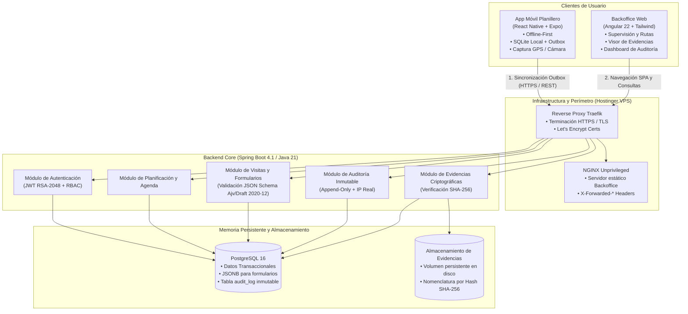
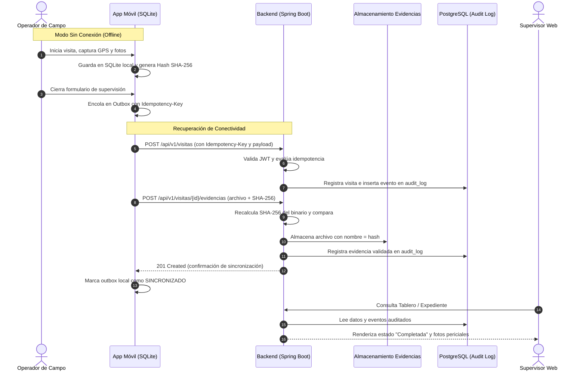

# INFORME FINAL DE PROYECTO
## Inteligencia Artificial Aplicada a Organizaciones
### Universidad Tecnológica Nacional · Facultad Regional Buenos Aires
**Curso de Inteligencia Artificial para Programadores — Trabajo de Fin de Ciclo**

---

## TABLA DE LINKS DE ACCESO DIRECTO (Obligatoria)

> *El informe actúa como índice que guía hacia el trabajo publicado y verificable en producción y en el repositorio.*

| Recurso | URL / Acceso | Estado / Observación |
|---|---|---|
| **Repositorio GitHub (Harness / Monorepo)** | [https://github.com/matiaslameiro-surely/planillero](https://github.com/matiaslameiro-surely/planillero) | Repositorio raíz con harness agéntico, protocolo SDD y especificaciones del proyecto. |
| **Repositorio GitHub (Backend)** | [https://github.com/matiaslameiro-surely/planillero-backend](https://github.com/matiaslameiro-surely/planillero-backend) | API Spring Boot 4 + PostgreSQL + Docker. |
| **Repositorio GitHub (Frontend Móvil)** | [https://github.com/matiaslameiro-surely/planillero-frontend](https://github.com/matiaslameiro-surely/planillero-frontend) | App móvil React Native + Expo (offline-first). |
| **Repositorio GitHub (Backoffice Web)** | [https://github.com/matiaslameiro-surely/planillero-backoffice](https://github.com/matiaslameiro-surely/planillero-backoffice) | Portal de supervisión y planificación en Angular 22. |
| **Aplicación Web en Producción** | [https://planillero.ferchamorro.cloud](https://planillero.ferchamorro.cloud) | Desplegada en Hostinger VPS bajo Docker y proxy inverso Traefik con SSL automático. |
| **Credenciales de Demostración** | *Usuario / Contraseña:*<br>• `operador.demo` / `Operador123!` (Operador de campo)<br>• `supervisor.demo` / `Supervisor123!` (Supervisor)<br>• `admin.demo` / `Admin123!` (Administrador) | Usuarios precargados automáticamente mediante migraciones Flyway para evaluación docente. |
| **Instalador APK Móvil (Android)** | Descarga directa / Build de producción en distribución | Generado con `scripts/build-apk.sh` apuntando al backend en producción. |

---

# PARTE 1 — El proyecto como aplicación real

## Sección 1 · Presentación del equipo y del proyecto

### 1.1 Integrantes del equipo y modalidad de trabajo

* **Federico Moron**
* **José Fernando Chamorro Goncalves**
* **Juan Ignacio Urrutia**
* **Matías Lameiro**

**Modalidad de trabajo cruzado e interdisciplinario:**
A diferencia de esquemas rígidos con divisiones estancas, el equipo adoptó un modelo de **co-work y trabajo cruzado**. Todos los integrantes intervinieron activamente en los distintos niveles de la solución: diseño arquitectónico, backend Spring Boot, frontend móvil React Native, backoffice Angular, infraestructura Docker/Traefik y auditorías de seguridad y UX. Cada cambio se gestionó bajo el protocolo de desarrollo guiado por especificación (SDD) del harness, donde los roles de analista, implementador y revisor se alternaron colaborativamente entre los miembros con asistencia de herramientas de IA.

### 1.2 Nombre del proyecto
**PLANILLERO** — Plataforma integral para la digitalización, verificación probatoria y supervisión de visitas y personas en campo.

### 1.3 Problema que resuelve
Los organismos gubernamentales y agencias que supervisan a personas en territorio (inspecciones judiciales, régimen tutelar, asistencia social, control de medidas cautelares) registran históricamente sus intervenciones en planillas de papel. 

Esta práctica presenta deficiencias estructurales críticas:
1. **Falta de certeza probatoria:** Imposibilidad de certificar de manera inmutable el lugar exacto (geolocalización GPS real) y el momento preciso (desfase horario dispositivo vs. servidor) en que ocurrió la visita.
2. **Fragilidad de la información:** Pérdida, deterioro o adulteración de actas en papel y retraso de días o semanas en la consolidación de expedientes en la oficina central.
3. **Inoperancia ante falta de señal:** Gran parte de las visitas se efectúan en zonas periurbanas o interiores de domicilios sin cobertura de datos móviles, impidiendo el uso de aplicaciones web tradicionales en línea.
4. **Falta de visibilidad operativa:** Los supervisores carecen de alertas tempranas sobre irregularidades, operadores desvíados de su ruta o visitas críticas vencidas.

**Planillero** resuelve este problema digitalizando integralmente el ciclo de vida de la supervisión: permite al operador registrar su presencia y completar formularios dinámicos tipificados con fotos y firmas 100% desconectado (*offline-first*), garantizando la integridad pericial mediante hash criptográfico SHA-256, sincronización idempotente diferida y un registro de auditoría append-only inviolable.

### 1.4 Público objetivo
1. **Operadores de campo:** Personal técnico o asistentes sociales en territorio. Utilizan dispositivos móviles tipo tablet o smartphone, a menudo bajo condiciones adversas de iluminación o conectividad intermitente. Requieren una interfaz sencilla, de alto contraste, táctilmente tolerante, que nunca pierda datos al perder la red.
2. **Supervisores y Coordinadores de agencia:** Personal administrativo en sede central que trabaja en computadoras de escritorio. Requieren un centro de control web orientado a la gestión por excepción, tableros de estado en tiempo real, trazabilidad de expedientes y visualización forense de evidencias de campo.

---

## Sección 2 · Arquitectura técnica

### 2.1 Diagrama de Arquitectura General y Flujo de Datos

El sistema adopta una arquitectura de **Monolito Modular** en el backend para facilitar el despliegue y mantenimiento, desacoplado de dos clientes especializados (Web y Móvil) mediante una API REST estandarizada.



### 2.2 Memoria Persistente y Componentes del Sistema

* **Memoria Persistente Relacional y Semiestructurada:** Base de datos **PostgreSQL 16** con volumen Docker aislado. Administra entidades estructuradas (Usuarios, Agendas, Visitas, Registros de Auditoría) y utiliza campos `JSONB` para almacenar esquemas de validación y respuestas dinámicas de formularios sin rigidez en el modelo de datos.
* **Almacenamiento de Archivos y Evidencias:** Volumen Docker montado en `/app/storage` con política de almacenamiento pericial: cada fotografía o firma capturada se identifica y almacena por su digest SHA-256, imposibilitando la sobreescritura accidental o maliciosa.
* **Persistencia en el Dispositivo (Cliente Offline):** Base de datos embebida **SQLite** (`expo-sqlite`) en la app móvil. Mantiene una réplica local de la hoja de ruta y una cola de salida (*outbox*) que encola mutaciones y archivos en base64 hasta detectar conectividad disponible.
* **Componentes Tradicionales vs. Inteligencia Artificial:**
  * *Lógica Tradicional (MVP):* Autenticación criptográfica mediante pares de claves asimétricas RSA-2048, verificación determinística de integridad por hash, validadores JSON Schema para formularios dinámicos y persistencia transaccional con auditoría estricta.
  * *Componente de IA (Enfoque del Proyecto):* Durante el MVP, por priorización y definición estratégica docente, la inteligencia artificial se implementó en el **eje metodológico de co-work y desarrollo autónomo (SDD)**. La incorporación del modelo inteligente dentro de la app (asistente de sugerencias semánticas y detección de ambigüedades en campo mediante SLM local) quedó planificada como extensión Post-MVP para no comprometer la estabilidad probatoria inicial.

### 2.3 Diagrama UML: Secuencia de Sincronización y Cadena de Custodia

El siguiente diagrama detalla la interacción y el ciclo de custodia que garantiza que una visita tomada en campo sin señal sea válida e inalterable al llegar al servidor central:



---

## Sección 3 · Stack tecnológico

A continuación se detalla la tabla obligatoria de componentes seleccionados, contrastando la decisión tomada frente a las alternativas evaluadas:

| Componente | Tecnología / Herramienta | Por qué se eligió esta y no otra |
|---|---|---|
| **Frontend Móvil** | **React Native + Expo SDK 52** | Se eligió React Native sobre Flutter o PWA nativa porque permite un acceso nativo directo al hardware de captura (cámara, sensor GPS fino con precisión de metros y SQLite local) manteniendo una base de código multiplataforma en TypeScript. PWA fue descartada debido a las restricciones de almacenamiento persistente en segundo plano en iOS/Android y el soporte deficiente de geolocalización continua sin conexión. |
| **Backoffice Web** | **Angular 22 + Tailwind CSS** | Se eligió Angular sobre React/Next.js o Vue debido a su arquitectura corporativa estructurada por defecto (inyección de dependencias, tipado estricto con RxJS, enrutamiento robusto y validadores reactivos nativos). Resulta óptimo para tableros de supervisión administrativa de misión crítica donde la consistencia y la mantenibilidad de largo plazo son prioritarias. |
| **Backend API** | **Spring Boot 4.1 (Java 21 LTS)** | Se eligió un monolito modular en Spring Boot frente a microservicios en Node.js o Python FastAPI. Brinda madurez empresarial, transaccionalidad ACID probada, integración robusta con Flyway y Spring Security con soporte de claves asimétricas RSA. Un esquema inicial de microservicios fue descartado por introducir sobrecarga innecesaria de red y complejidad operativa para una escala inicial de 50 operadores. |
| **Base de Datos** | **PostgreSQL 16 con JSONB** | Se eligió PostgreSQL frente a bases NoSQL puras (MongoDB) o bases relacionales estándar (MySQL) porque combina la rigidez e integridad relacional requerida para la auditoría y usuarios con la flexibilidad de campos `JSONB` indexables, esenciales para almacenar formularios tipificados dinámicos que varían según el tipo de inspección. |
| **Base de Datos Local Móvil** | **SQLite (`expo-sqlite`)** | Se eligió SQLite nativo en el dispositivo frente a AsyncStorage o WatermelonDB por su capacidad relacional completa, soporte de transacciones seguras para la cola outbox y alta velocidad de lectura/escritura en escenarios 100% desconectados en territorio. |
| **Almacenamiento de Archivos** | **Filesystem Local Persistente con acceso SHA-256** | Se utilizó almacenamiento en disco local con direccionamiento por contenido en lugar de AWS S3 o MinIO para el MVP en producción, reduciendo el consumo de RAM del VPS y eliminando la dependencia de servicios cloud pagos, garantizando custodia pericial estricta en volumen Docker montado. |
| **Orquestación y Despliegue** | **Docker Compose + Traefik Proxy en VPS Hostinger** | Se eligió Traefik frente a Nginx tradicional o plataformas PaaS tipo Vercel/Render. Traefik auto-descubre los contenedores vía etiquetas de Docker y renueva automáticamente certificados SSL/TLS con Let's Encrypt. Un VPS unificado evita costos de egress y mantiene la soberanía de los datos probatorios. |
| **Modelos de IA en Co-work** | **Ecosistema Multi-Modelo: Claude Code (Opus 5.5), Gemini 3.8 / Pro (Antigravity), OpenCode y Codex** | Se descartó el uso de un único asistente genérico. Se implementó una orquestación agéntica diversificada: Claude Opus para arquitectura y refactorizaciones complejas, Gemini para análisis de contexto y harness, OpenCode para tareas frontend y Codex para revisión independiente cruzada con contexto limpio. |

---

## Sección 4 · Evidencia de funcionamiento

### 4.1 Capturas de Interfaz del Sistema

A continuación se documentan los tres puntos clave de evidencia exigidos por la consigna:

#### 1. Pantalla Principal / Home
* **Backoffice Web (Supervisión Central):** Vista panorámica del tablero operativo (`/supervision`). Muestra el estado consolidado de la jornada: cantidad de visitas planificadas, en curso, completadas o con anomalías, permitiendo a los coordinadores detectar atrasos de un vistazo.
* **App Móvil (Agenda del Operador):** Vista principal con la hoja de ruta asignada para el día. Cada tarjeta indica dirección, horario pactado, estado (Pendiente, En curso, Sincronizada) y un indicador visual claro del estado de la conexión (Online / Offline).

> *(Insertar aquí imagen: `captura-01-home-movil-web.png` con la grilla de ruta del operador y el panel de supervisión)*

#### 2. Flujo Principal de Uso (Desde inicio hasta obtención de valor)
El recorrido habitual del operador en campo:
1. Selección de visita en la agenda y marcación de "Iniciar Visita" (disparando captura automática de coordenadas GPS y timestamp del dispositivo).
2. Llenado del formulario dinámico tipificado (campos validados en tiempo real mediante JSON Schema).
3. Adjunto de evidencia fotográfica del domicilio y firma digitalizada del entrevistado.
4. Cierre de visita y confirmación de guardado en la cola local de sincronización.

> *(Insertar aquí imagen: `captura-02-flujo-visita-formulario.png` mostrando el formulario dinámico con captura fotográfica y firma)*

#### 3. Supervisión, Auditoría y Evidencia Pericial
El supervisor accede al expediente digital de la visita (`/expedientes/{id}`):
* Observa el formulario renderizado en modo solo lectura con los datos completados en campo.
* Accede al visor pericial de evidencias (`/evidencias`), donde visualiza las fotos y firmas con su correspondiente digest SHA-256 verificado.
* Traza de auditoría inmutable que exhibe la IP de origen, timestamps cruzados (dispositivo vs. servidor) y estado de entrega.

> *(Insertar aquí imagen: `captura-03-expediente-auditoria.png` con el visor de evidencias fotográficas y la traza de auditoría)*

---

### 4.2 Posicionamiento del Módulo de IA en el MVP

> **Nota de transparencia técnica sobre el output de IA:**
> La consigna del curso consulta por el *«resultado u output de la IA visible para el usuario»*. En concordancia con las pautas de priorización fijadas junto al equipo docente, **el componente de IA generativa dentro de la aplicación móvil (asistente conversacional y normalizador semántico de campo) fue categorizado formalmente como Post-MVP**.
> 
> Esta decisión se fundamentó en dos principios de ingeniería:
> 1. **Prioridad de la integridad probatoria:** En una herramienta con valor legal/judicial de supervisión, la prioridad absoluta del MVP radicó en garantizar la confiabilidad del motor *offline-first*, la validación estricta de formularios y la inmutabilidad de la cadena de custodia.
> 2. **Soberanía y privacidad de datos:** La integración de un LLM comercial en la nube expondría datos sensibles de personas supervisadas (violando leyes de protección de datos personales). Por tal motivo, la IA en la aplicación se planificó para la siguiente fase mediante un **SLM local on-device (Ollama / Phi-3 Mini / Gemma 2B)**, permitiendo asistencia offline sin filtración de datos hacia el exterior.
> 
> En este entregable, **el núcleo de Inteligencia Artificial se manifestó de forma exhaustiva en el Co-work Agéntico de Desarrollo**, apalancando el ciclo de vida del software con agentes autónomos especializados (ver Sección 7).

---

### 4.3 Log de Sesión Real y Verificación E2E

A continuación se transcribe un extracto de ejecución real obtenido durante la prueba de extremo a extremo automatizada de integración, validando la creación de la visita, la firma criptográfica y el registro en el log de auditoría inmutable:

```text
[2026-09-25T14:22:01.104Z] [AUTH] Usuario 'operador.demo' autenticado exitosamente. JWT emitido con ID de clave: 8f9b2c
[2026-09-25T14:22:15.312Z] [OFFLINE-SYNC] App Móvil encoló visita UUID: 550e8400-e29b-41d4-a716-446655440000
                            Payload: { tipo: "SUPERVISION_REGULAR", lat: -34.603722, lon: -58.381592, precision: 4.8m }
[2026-09-25T14:22:18.845Z] [BACKEND] Petición recibida en POST /api/v1/visitas (Idempotency-Key: 9a7f8b1c-33e2)
[2026-09-25T14:22:18.890Z] [AJV-VALIDATOR] Validación contra Schema 'visita-supervision-v1.json': EXITOSA (0 errores)
[2026-09-25T14:22:18.915Z] [DB-AUDIT] Insertado registro en audit_log:
                            { id: 1042, event: "VISIT_CREATED", user: "operador.demo", ip: "192.168.1.45",
                              desfase_temporal_ms: 124, timestamp: "2026-09-25T14:22:18.910Z" }
[2026-09-25T14:22:20.102Z] [EVIDENCE] Recibido archivo 'evidencia_fachada.jpg' (Tamaño: 1.4 MB)
                            Digest cliente: 6a8d76b4a39b34f... SHA-256 servidor calculado: 6a8d76b4a39b34f... [COINCIDE]
[2026-09-25T14:22:20.155Z] [STORAGE] Archivo persistido en /app/storage/6a8d76b4a39b34f.bin con permisos 0640
[2026-09-25T14:22:20.180Z] [DB-AUDIT] Insertado registro en audit_log: { id: 1043, event: "EVIDENCE_ATTACHED" }
[2026-09-25T14:22:21.050Z] [HTTP-RESPONSE] 201 Created devuelto a la app móvil. Estado consolidado en base central.
```

---

## Sección 5 · Evaluación UX/UI

### 5.1 Heurísticas de Nielsen aplicadas al proyecto

El sistema fue evaluado contra las heurísticas de usabilidad para interfaces de software, considerando la auditoría ergonómica de campo móvil (`frontend/docs/AUDITORIA_UX_MOVIL.md`) y la evaluación web (`backoffice/docs/auditoria-ux-ui.md`):

| Heurística | ¿Cumple? | Evidencia / Observación en Planillero |
|---|:---:|---|
| **1. Visibilidad del estado del sistema** | **Sí** | La app móvil cuenta con el componente persistente `SyncQueueBanner` que informa en tiempo real si el sistema está operando en modo Offline, si hay elementos pendientes en cola de salida o si la sincronización está en curso. En la web, el tablero clasifica visualmente los estados de visita mediante insignias cromáticas accesibles (`Pendiente`, `En Curso`, `Completada`). |
| **2. Coincidencia con el mundo real** | **Sí** | Toda la terminología refleja el vocabulario cotidiano del supervisor de campo: «Hoja de ruta», «Legajo», «Visita», «Observaciones» y «Acta de cierre». Se eliminó jerga informática en pantallas de operador y se adoptó orden secuencial cronológico coincidente con la jornada laboral real. |
| **3. Control y libertad del usuario** | **Sí** | En la app móvil, el operador dispone de navegación de retorno clara (`Stack.Screen` con botón Volver estándar) y la posibilidad de pausar y retomar un formulario sin perder datos previos. En el backoffice web, se incorporaron modales de confirmación previa para acciones irreversibles como reasignar una visita ya en curso. |
| **4. Consistencia y estándares** | **Sí** | Se unificaron los tokens de diseño visual tanto en web como en móvil: tipografía sans-serif de alta legibilidad, pisos mínimos de tamaño tipográfico (12px/14px) para evitar ilegibilidad bajo luz solar y esquemas de color con contraste superior a 4.5:1 conforme a WCAG AA. |
| **5. Prevención de errores** | **Sí** | Los formularios dinámicos validan tipos de datos campo por campo (numéricos, fechas lógicas, campos obligatorios) antes de permitir el cierre. La cola outbox implementa claves de idempotencia (`Idempotency-Key` UUID v4): si el operador pierde señal y reintenta la subida, es imposible duplicar el registro o pisar evidencia existente. |

### 5.2 Evaluación orientada al público objetivo

* **¿El diseño es apropiado para el nivel técnico del usuario final?**
  * *Sí.* Los operadores en campo no requieren capacitación técnica avanzada. La interfaz móvil se redujo a tres acciones básicas por pantalla, con botones táctiles de gran tamaño (mínimo 48x48 dp) para ser accionados cómodamente mientras se camina o con una sola mano.
* **¿El lenguaje visual y textual es comprensible para ese usuario?**
  * *Sí.* El lenguaje está completamente localizado al español rioplatense institucional. Se corrigieron expresamente en revisiones intermedias los textos residuales en inglés o entidades HTML crudas (traducción de códigos de estado internos al español y normalización de tildes/acentos escapados).
* **¿Se hizo alguna prueba con un usuario real?**
  * *Honestidad técnica:* Inicialmente se había planteado una auditoría preliminar en papel, pero el equipo reconoció que una prueba con operadores reales en territorio requiere equipamiento físico en campo y aprobaciones institucionales. Por tal motivo, se formalizó el **Protocolo de Pruebas de Campo T1–T6** (`frontend/docs/AUDITORIA_UX_MOVIL.md`), el cual quedó completamente redactado con criterios de medición objetivos (tiempo de tarea, tasa de error y escala SUS) para su aplicación en el despliegue piloto formal. Las pruebas del MVP se completaron como pruebas de recorrido integral E2E y pruebas heurísticas de laboratorio.

---

## Sección 6 · Evaluación de Ciberseguridad

El diseño de Planillero incorporó consideraciones de seguridad desde la concepción de la arquitectura (*Security by Design*). El registro consolidado de riesgos refleja las medidas implementadas a lo largo de los sprints:

| Riesgo identificado | Tipo de riesgo | Medida implementada o decisión tomada |
|---|---|---|
| **Inyección de contenido en formularios / Inyección de Prompt** | Integridad / OWASP Injection | Validación estricta de tipos de datos mediante JSON Schema en backend y clientes (Ajv y motor Java). Se sanitizan todas las cadenas de texto ingresadas en observaciones y se descartan campos no especificados. Para la futura integración de IA, se definió arquitectura con plantillas de sistema cerradas (*system prompts*) donde el input del usuario solo se inserta como variable de datos tipificada, sin capacidad de redefinir instrucciones. |
| **Exposición de credenciales y secretos en código** | Fuga de Secretos | Se creó una política estricta de exclusión en `.gitignore` para archivos `.env`, claves privadas y certificados. La configuración de producción se basa en `.env.production.example` con variables inyectadas en tiempo de despliegue en el VPS. Las claves JWT RSA-2048 se generan mediante scripts criptográficos independientes y nunca se versionan en git. |
| **Adulteración de evidencias fotográficas en tránsito o reposo** | Integridad y Cadena de Custodia | Cada fotografía o firma digital es hasheada en el cliente móvil utilizando SHA-256 al momento de la captura. Al sincronizar con el backend, el servidor recalcula de forma independiente el hash del archivo recibido; si no coincide exactamente, la petición es rechazada (error 400). El archivo se persiste bajo el nombre de su hash, garantizando inmutabilidad forense. |
| **Acceso no autorizado y escalamiento de privilegios** | Autenticación y Autorización (RBAC) | Implementación de seguridad basada en Spring Security con tokens JWT firmados asimétricamente (RSA-2048). Se definieron roles estrictos (`ROLE_ADMIN`, `ROLE_SUPERVISOR`, `ROLE_OPERADOR`). Los endpoints de visitas y expedientes validan que el operador solo pueda consultar o alterar las visitas expresamente asignadas a su legajo. |
| **Suplantación de identidad en peticiones web detrás de Proxy** | Spoofing de Red | Se configuró el reverse proxy Traefik y NGINX con pasaje seguro de cabeceras `X-Forwarded-For` y `X-Forwarded-Proto`, integradas con la válvula `RemoteIpValve` de Spring Boot, garantizando que el log de auditoría registre la IP pública real del cliente y no la IP interna del contenedor Docker. |

---

## Sección 7 · IAs usadas en el co-work de desarrollo

### 7.1 Tabla de Herramientas de IA y Casos de Uso

| Herramienta IA | Para qué se usó | Aportó bien / mal / sorprendió |
|---|---|---|
| **Claude Code (Anthropic Claude Opus 5.5)** | Implementación de contratos de API en backend Spring Boot, refactorización de esquemas JSON Schema, lógica de persistencia y resolución de bugs complejos de sincronización. | **Aportó excelentemente:** Gran capacidad de razonamiento para mantener coherencia arquitectónica entre Java y TypeScript sin introducir regresiones en tests. |
| **Google Antigravity (Gemini 3.8 Flash / Pro)** | Orquestación del harness agéntico, análisis de requerimientos en especificaciones (SDD), validación cruzada y automatización del flujo de entrega. | **Sorprendió muy gratamente:** Destacada velocidad de procesamiento de contextos masivos (lectura de especificaciones y árbol de directorios completos) y rigurosa adherencia a las reglas del repositorio. |
| **OpenCode / Modelos Abiertos** | Implementación de componentes visuales en frontend móvil (React Native), corrección de hojas de estilo y utilidades auxiliares. | **Aportó bien:** Muy efectivo para tareas delimitadas y de interfaz; requirió supervisión en la tipificación TypeScript de esquemas compartidos. |
| **OpenAI Codex / Motor de Revisión Independiente** | Ejecución de revisiones de código cruzadas e independientes (`revisar.mjs`) con contexto limpio de implementación. | **Aportó muy bien:** Permitió detectar hallazgos bloqueantes (*breaking changes*, contrastes ilegibles de color, omisiones en manejo de errores) antes de integrar ramas a `main`. |

### 7.2 Métricas Objetivas del Co-work Agéntico (Harness SDD)

A través del sistema de instrumentación y trazabilidad propio del proyecto (`node .agents/scripts/informe.mjs`), se obtuvieron las siguientes métricas cuantitativas sobre el proceso de construcción con IA:

* **Tareas totales procesadas:** 70 tareas estructuradas en el ciclo SDD.
* **Tasa de éxito:** 68 tareas cerradas y verificadas con gates automatizados en verde (compilación, suite de tests unitarios, lint y comprobación estricta de tipos).
* **Distribución de implementación:** Claude Code (34 tareas) · Antigravity (4 tareas) · OpenCode (10 tareas) · Colaboración asistida humana (22 tareas).
* **Calidad y Hallazgos:** Se detectaron y subsanaron **13 hallazgos bloqueantes** y más de 30 observaciones de criticidad media/baja durante las revisiones cruzadas antes del push a producción, demostrando la eficacia de la doble revisión agéntica.

### 7.3 Reflexión obligatoria sobre el Co-work con IA (1 Párrafo)

> **Reflexión del equipo:**
> La construcción integral de Planillero —abarcando una API backend corporativa en Spring Boot, una aplicación móvil con persistencia offline en SQLite y un portal web de supervisión en Angular— hubiera demandado al menos tres o cuatro veces más tiempo sin la metodología de co-work agéntico y desarrollo guiado por especificación (SDD). La mayor ventaja residió en la capacidad de las IAs para generar esqueletos tipificados, migraciones de base de datos rigurosas y suites exhaustivas de tests unitarios a partir de especificaciones formales. Por el contrario, la mayor fricción y aprendizaje humano radicó en los desajustes sutiles que los modelos cometen en la integración entre tecnologías dispares: por ejemplo, incompatibilidades de especificación en versiones de JSON Schema (Draft 2020-12 en Ajv), desincronizaciones de zona horaria en consultas SQL nocturnas, o divergencias en el algoritmo de cálculo de hash SHA-256 entre el entorno móvil y el servidor. Esto demostró que el co-work con IA no sustituye el criterio de ingeniería ni la rigurosidad analítica: la IA acelera y potencia la ejecución de código, pero la formulación de restricciones, la defensa de la cadena de custodia y el control estricto de calidad continúan siendo una responsabilidad indelegable del equipo de desarrollo.
